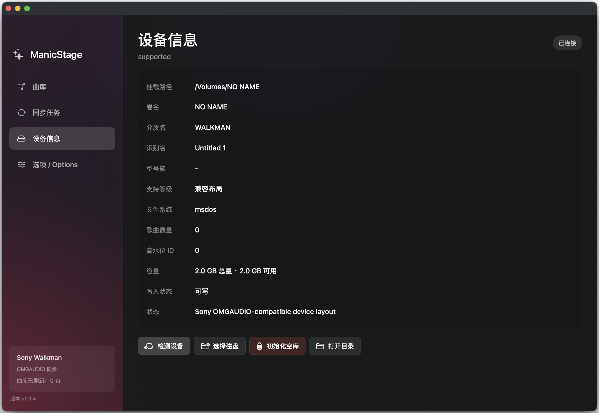
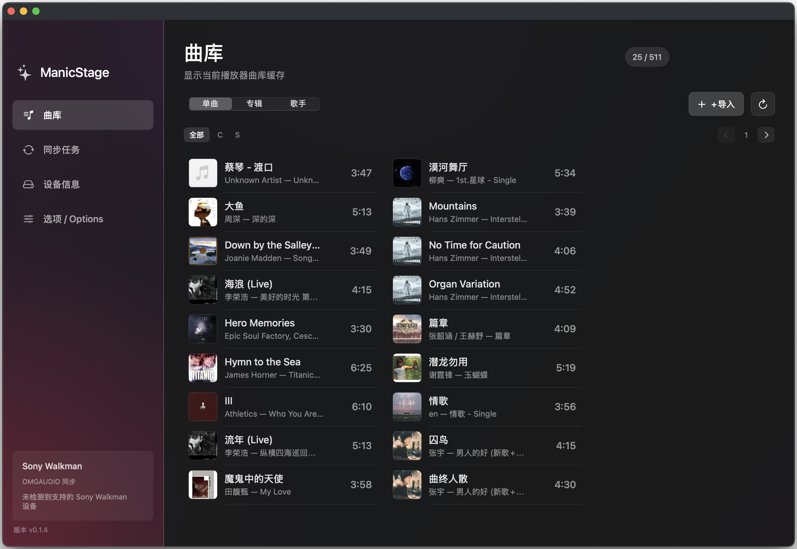
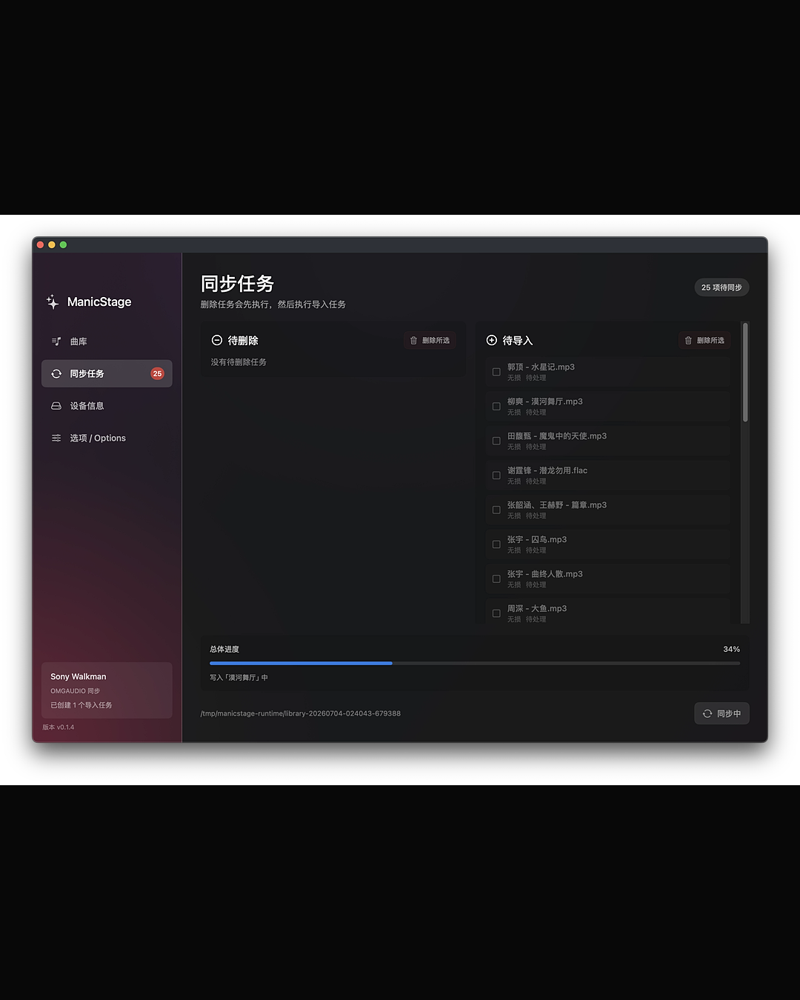

# ManicStage - Sony Walkman sync for macOS

ManicStage is a native macOS music sync app for older Sony Walkman players that use the `OMGAUDIO` library structure. It is designed as a modern Mac workflow for SonicStage / OpenMG-era Walkman devices, including Sony NW-S, NW-E, NW-A, NW-HD, and NW-MS series players that originally depended on Sony software for music transfer.

If you are looking for a SonicStage alternative for Mac, a Sony Walkman `OMGAUDIO` manager, or a way to import and delete music on classic Sony Walkman devices from macOS, ManicStage is built for that specific problem.

ManicStage is **not** a general-purpose music player. It is **not** a modern Walkman manager. It is not affiliated with Sony. Its first target is SonicStage-era Sony `OMGAUDIO` Walkman devices that have been verified or can be safely tested with a full backup.

## For people searching for a Walkman sync tool

ManicStage may be useful if you are searching for:

- Sony Walkman sync tool for macOS
- SonicStage alternative for Mac
- SonicStage replacement for Sony Walkman
- Sony Walkman music transfer app
- Sony Walkman `OMGAUDIO` manager
- Sony NW-S705F / NW-S706F / NW-S700 music sync
- Sony NW-E300 / NW-E400 / NW-E500 music transfer
- Sony NW-A600 Walkman sync for Mac
- Sony NW-HD1 / NW-HD3 / NW-HD5 SonicStage transfer
- Sony NW-A1000 / NW-A3000 / NW-A805 SonicStage alternative
- Sony NW-MS70D / NW-MS90D OpenMG / SonicStage transfer
- Import music to old Sony Walkman without SonicStage
- Delete songs from SonicStage-era Walkman on Mac
- 索尼 Walkman 同步工具
- SonicStage 替代工具
- Mac 上给索尼 Walkman 传歌
- 老索尼 Walkman 导入音乐

## What it helps with

- Sync music to classic Sony Walkman players on macOS, including S, E, and A series SonicStage-era devices.
- Replace the basic music-transfer workflow that used to require SonicStage.
- Read the existing Walkman music library, including songs, albums, artists, and covers.
- Import local music files and preserve compatible MP3 audio when possible.
- Delete songs from the Walkman and update the required `OMGAUDIO` database files.
- Initialize an empty usable Walkman library after device-side formatting.

## Quick links

- [Important backup warning](#important-back-up-your-walkman-first)
- [Supported Sony Walkman devices](#device-support)
- [Installation](#installation)
- [First-time usage](#first-time-usage)
- [Audio import strategy](#audio-import-strategy)
- [Troubleshooting](#troubleshooting)

## License and redistribution

ManicStage is provided as an official public test build for personal use only. See [LICENSE](LICENSE) for the full proprietary notice.

You may download and use unmodified official release packages from this repository. You may not redistribute, mirror, repackage, or re-upload ManicStage DMG files, ZIP files, app bundles, executable binaries, helper binaries, bundled templates, UI resources, images, payment/contact QR codes, integrity/signature files, or extracted `ManicStage.app/Contents` files without prior written permission.

Unofficial builds, unpacked app bundles, copied binaries, and modified resources are not authorized releases.

## Important!!! Back up your Walkman first!!!

Before using ManicStage for the first time, back up the entire USB root directory of your Walkman to your computer.

Do not back up only the `OMGAUDIO` folder. Copy the whole mounted Walkman volume.

For example, if your Walkman appears as a mounted USB drive in Finder, copy everything from that drive into a safe folder on your Mac before initializing, importing, deleting, or syncing music with ManicStage.

This matters because older `OMGAUDIO` devices rely on multiple database files, indexes, search trees, and cached metadata. A full backup gives you a way to restore the original device state if something goes wrong.

> **After making a full backup, follow the [First-time usage](#first-time-usage) section below for your first setup and sync.**

## System requirements

- macOS 15 or later
- Apple Silicon Mac, M-series chip
- A Sony Walkman that mounts as a USB storage device and uses the `OMGAUDIO` library structure
- FFmpeg / FFprobe installed locally if you want ManicStage to transcode unsupported audio formats

## Device support

ManicStage primarily targets Sony Walkman devices that use the `OMGAUDIO` music library structure and originally depended on SonicStage, CONNECT Player, or OpenMG-era Sony software for music transfer.

Verified devices:

- Sony Walkman NW-S700 series, including S705 / S705F / S706 / S706F / S703F-style devices
- Sony Walkman NW-S600 series
- Sony Walkman NW-E300 series
- Sony Walkman NW-E400 series
- Sony Walkman NW-E500 series
- Sony Walkman NW-A600 series

Other Sony Walkman devices that require SonicStage/OpenMG-style music syncing may work if they use a compatible `OMGAUDIO` library layout, but they should be treated as unverified until tested.

If you try ManicStage with an unverified SonicStage-era Walkman, back up the entire Walkman USB root directory first, then verify the result on the device.

If you try ManicStage with another `OMGAUDIO` Walkman, please report:

- Device model
- macOS version
- Whether the device was detected
- Whether import, delete, sync, playback, search, and cover display worked
- Whether the device entered Simple Mode

### Compatibility at a glance

| Device family | Status | Notes |
| --- | --- | --- |
| Sony NW-S700 / NW-S600 Walkman | Verified | Main target for ManicStage. Tested around S705-era `OMGAUDIO` behavior. |
| Sony NW-E300 / NW-E400 / NW-E500 Walkman | Verified | SonicStage-era devices using compatible `OMGAUDIO` library data. |
| Sony NW-A600 Walkman | Verified | Uses the same general `OMGAUDIO` sync family. |
| Sony NW-E000 / NW-E010 Walkman | Likely compatible | SonicStage-era USB-stick style models; please test with a full backup. |
| Sony NW-S200 / NW-S610 / NW-S710 Walkman | Likely compatible | SonicStage-era sports and compact S-series models; please test before relying on it. |
| Sony NW-A800 / NW-A900 / NW-A1000 / NW-A3000 Walkman | Experimental | SonicStage/CONNECT Player-era A-series models; database behavior may differ. |
| Sony NW-HD hard disk Walkman | Experimental | SonicStage-era hard disk models; not the main test target yet. |
| Sony NW-MS Memory Stick Walkman | Experimental | Earlier OpenMG/SonicStage-era models; may need different media behavior. |
| Other SonicStage-era `OMGAUDIO` Walkman models | Experimental | Full device backup required before testing. |
| Modern Android / drag-and-drop Walkman models | Not a target | Use the normal file-transfer workflow instead. |

### SonicStage / OpenMG-era model index

The following model names are included here so people searching for a SonicStage alternative, Sony Walkman transfer tool, or OpenMG / `OMGAUDIO` sync utility can find this project. Not every model below has been physically verified with ManicStage yet.

| Family | Model names people may search for |
| --- | --- |
| NW-MS Memory Stick Walkman | NW-MS7, NW-MS9, NW-MS10, NW-MS11, NW-MS70D, NW-MS77DR, NW-MS90D |
| NW-HD hard disk Walkman | NW-HD1, NW-HD2, NW-HD3, NW-HD5 |
| NW-A600 series | NW-A605, NW-A607, NW-A608 |
| NW-A1000 / NW-A3000 series | NW-A1000, NW-A1200, NW-A3000 |
| NW-A800 series | NW-A805, NW-A806, NW-A808 |
| NW-A900 series | NW-A916, NW-A918, NW-A919 |
| NW-E early flash series | NW-E2, NW-E3, NW-E5, NW-E7, NW-E8P, NW-E10 |
| NW-E50 / E70 / E90 series | NW-E55, NW-E73, NW-E75, NW-E95, NW-E99 |
| NW-E100 series | NW-E103, NW-E105, NW-E105PS, NW-E107 |
| NW-E200 / E300 series | NW-E205, NW-E207, NW-E305, NW-E307 |
| NW-E400 series | NW-E403, NW-E405, NW-E407 |
| NW-E500 series | NW-E503, NW-E505, NW-E507 |
| NW-E000 series | NW-E002, NW-E003, NW-E005, NW-E002F, NW-E003F, NW-E005F |
| NW-E010 series | NW-E013, NW-E015, NW-E016, NW-E013F, NW-E015F, NW-E016F |
| NW-S200 series | NW-S202, NW-S203F, NW-S205F |
| NW-S600 series | NW-S603, NW-S605 |
| NW-S700 series | NW-S703F, NW-S705F, NW-S706F |
| NW-S610 series | NW-S615F, NW-S616F, NW-S618F |
| NW-S710 series | NW-S715F, NW-S716F, NW-S718F |

Models with `NWZ-` prefixes and later drag-and-drop Walkman players are generally outside ManicStage's target scope.


## What ManicStage does

ManicStage provides a modern macOS workflow for older Sony Walkman devices:

- Detect mounted Sony Walkman / `OMGAUDIO` devices.
- Read the device music library.
- Show songs, albums, artists, and device information.
- Import local music files to the device.
- Delete songs from the device.
- Manage pending sync tasks before writing changes.
- Initialize a minimal usable empty library on an empty device.
- Preserve compatible MP3 audio when possible instead of re-encoding it.
- Maintain the library indexes, search trees, and cover cache required by S705-era devices.
- Use the user's local FFmpeg / FFprobe installation for audio probing, transcoding, metadata migration, and cover handling when needed.

## ManicStage vs SonicStage

SonicStage was Sony's original music management software for many older Walkman players, but it is difficult to use on modern Macs and often requires an old Windows installation or a virtual machine.

ManicStage does not try to clone every SonicStage feature. Instead, it focuses on the daily tasks that make these old Walkman players usable again:

- Import music from macOS to a SonicStage-era Walkman.
- Delete songs from the Walkman without opening SonicStage.
- Rebuild and update the `OMGAUDIO` library files required by the device.
- Keep compatible MP3 files when possible, and transcode unsupported formats when needed.
- Display the device library in a modern macOS app.

## Screenshots

### Device information

Detect a mounted Walkman, review device information, and select the target disk when needed.



### Library

Browse songs on the device before importing or deleting music.



### Sync tasks

Review pending imports and deletions before writing changes to the Walkman.



## What ManicStage does not do

ManicStage is intentionally narrow in scope:

- It is not a replacement for every SonicStage feature.
- It is not a general music player.
- It is not a manager for modern Walkman devices.
- It does not provide manual editing for song title, artist, album, genre, or release year.
- It does not provide manual cover replacement.
- It does not generate ATRAC Advanced Lossless.
- It does not depend on SonicStage or the proprietary OpenMG encoding chain.
- It does not guarantee full compatibility with every Walkman model.

## Installation

1. Download `ManicStage-<version>.dmg` from the release page.
2. Open the DMG.
3. Drag `ManicStage.app` into `/Applications`.
4. Launch ManicStage.

If macOS shows a security prompt, open the app according to your local macOS security settings.

## First-time usage

### 0. Back up the device

Before doing anything else, back up the entire Walkman USB root directory to your Mac.

This is the most important first-time step.

### 1. Connect the Walkman

Connect your Sony Walkman to your Mac using USB.

Wait until macOS mounts it as a USB volume.

### 2. Select the device disk

Open ManicStage and go to the device information page.

ManicStage can try to detect a mounted Sony Walkman / `OMGAUDIO` device automatically. If automatic detection does not find the device, manually select the mounted Walkman directory.

Choose the Walkman USB root directory, not only the `OMGAUDIO` subfolder.

### 3. Initialize an empty library if needed

If this is your first time using the device with ManicStage, or if the device has an empty or missing library, initialize an empty library.

This creates the minimal library structure required for ManicStage to manage music on the device.

Only do this after making a full backup.

### 4. Add or delete music

Open the library page to view songs already on the device.

To add music, click import and select local audio files from your Mac.

To delete music, select songs in the library and mark them for deletion.

Adding and deleting songs creates pending sync tasks. These changes are not written to the Walkman immediately.

### 5. Review sync tasks

Open the sync tasks page and review the pending imports and deletions.

This step lets you confirm what ManicStage is about to write to the device.

### 6. Click sync

Click sync to write the pending changes to the Walkman.

ManicStage will update the audio files, library database, indexes, search trees, and related cache files needed by the device.

### 7. Eject safely

When sync is finished, safely eject the Walkman from macOS before unplugging it.

Then check the device itself:

- Playback
- Song search
- Album search
- Cover display

If the device shows **Simple Mode**, it is usually not a fatal problem. Simple Mode means some advanced search features, such as Genre Search or Release Year Search, may be unavailable, but basic playback can still work.

## Known limits

- The library limit follows S705-era constraints. ManicStage currently treats the upper bound as about 511 songs.
- Manual metadata editing is not supported.
- Manual cover replacement is not supported.
- S705 cover data is album/group-level, not the per-track cover model used by many modern players.
- WMA is not preserved as a passthrough target and is usually transcoded.
- AAC-LC is usually transcoded in the current version.
- WAV is usually transcoded in the current version, unless using a lossless strategy that outputs 44.1 kHz / 16-bit / stereo WAV.
- Compatibility with devices outside the verified list should be considered experimental until confirmed.

## Audio import strategy

ManicStage follows a simple rule:

Keep the original audio when it is already compatible. Transcode only when needed.

| Input format | Current behavior |
| --- | --- |
| Compatible MP3 | Preserved without re-encoding |
| Incompatible MP3 | Transcoded to compatible MP3 |
| FLAC / ALAC / APE / DSD | Transcoded |
| Opus / Ogg Vorbis | Transcoded |
| WMA | Transcoded |
| AAC-LC | Usually transcoded in the current version |
| WAV | Usually transcoded in the current version; under a lossless strategy, it may be converted to 44.1 kHz / 16-bit / stereo WAV |

Recommended output targets:

- General balance between compatibility and capacity: LAME MP3 V2 VBR
- Higher quality lossy output: LAME MP3 V0 VBR
- Maximum lossy compatibility: MP3 320 kbps CBR
- Lossless strategy: 44.1 kHz / 16-bit / stereo WAV

## FFmpeg and FFprobe

ManicStage does **not** bundle FFmpeg or FFprobe.

When transcoding or audio probing is needed, ManicStage calls the FFmpeg / FFprobe tools installed on your Mac.

They are used for:

- Audio format detection
- Compatibility probing
- Transcoding unsupported formats
- Metadata migration
- Cover handling

You can install FFmpeg with Homebrew:

```bash
brew install ffmpeg
```

After installation, make sure `ffmpeg` and `ffprobe` are available in your shell path.

```bash
ffmpeg -version
ffprobe -version
```

If ManicStage cannot find FFmpeg / FFprobe, compatible MP3 passthrough may still work, but transcoding and some metadata or cover operations may be unavailable.

## Safety notes

- Always back up the whole Walkman USB root directory before first use.
- Do not unplug the device while sync is running.
- Eject the Walkman safely after syncing.
- Keep your original local music files on your Mac.
- Treat unsupported Walkman models as experimental until confirmed.

## Troubleshooting

### ManicStage does not detect my Walkman

- Make sure the Walkman is mounted in Finder.
- Confirm that the mounted volume contains an `OMGAUDIO` folder.
- Try selecting the mounted Walkman root directory manually.
- Do not select only the `OMGAUDIO` folder.

### Imported songs do not appear on the device

- Confirm that you clicked sync after importing.
- Eject the device safely and then check the Walkman.
- Make sure the library has not exceeded the supported song limit.

### The device enters Simple Mode

Simple Mode may indicate that some advanced search indexes are unavailable or limited.

Basic playback can still work, but features such as Genre Search or Release Year Search may not be available.

### Transcoding fails

- Install FFmpeg with Homebrew.
- Confirm `ffmpeg -version` and `ffprobe -version` work in Terminal.
- Try importing a compatible MP3 file to verify basic passthrough behavior.

## Support & contact

ManicStage is free to use. All features are free, and support is completely voluntary.

If ManicStage helped bring your old Walkman back into use, or if you appreciate this little project, any contribution is appreciated.

<p>
  
  
</p>

For device stories, compatibility feedback, logs, bug reports, or a friendly chat, you can reach me here:

- Email: [ming.horizon@icloud.com](mailto:ming.horizon@icloud.com)
- GitHub: [whiteskyline/ManicStage](https://github.com/whiteskyline/ManicStage)
- YouTube: [@ZaichuanLin](https://www.youtube.com/@ZaichuanLin)
- Xiaohongshu / 小红书: [GoodDog](https://www.xiaohongshu.com/user/profile/5bef04fc96d5be00014890f3)
- Reddit: [u/HorizonDog777](https://www.reddit.com/user/HorizonDog777/)
- WeChat / 微信: `HorizonDog`

The WeChat QR code is for contact, not payment.

<p>
  
</p>

## Related search phrases and model names

ManicStage is intended for people looking for a Sony Walkman sync utility, a macOS music transfer app for old Walkman players, or a SonicStage-era `OMGAUDIO` library manager.

Common related searches include:

- Sony Walkman sync app
- Sony Walkman sync software
- Sony Walkman transfer tool
- Sony Walkman music manager for Mac
- Sony Walkman Mac music transfer
- Sony Walkman SonicStage alternative
- Sony Walkman OpenMG alternative
- SonicStage alternative macOS
- SonicStage replacement Mac
- SonicStage replacement for Sony Walkman
- SonicStage not working on modern macOS
- Sony Walkman needs SonicStage
- Sony Walkman songs not showing after copy
- Sony Walkman cannot play files copied with Finder
- Sony Walkman cannot play files copied with Windows Explorer
- OMGAUDIO sync tool
- OMGAUDIO database manager
- OpenMG Jukebox alternative
- old Sony Walkman music transfer
- classic Sony Walkman sync
- NW-S700 sync
- NW-S600 sync
- NW-E300 sync
- NW-E400 sync
- NW-E500 sync
- NW-E000 sync
- NW-E010 sync
- NW-S200 sync
- NW-S610 sync
- NW-S710 sync
- NW-A600 sync
- NW-A800 sync
- NW-A1000 sync
- NW-A3000 sync
- NW-HD5 sync
- NW-MS70D sync
- NW-E405 transfer music
- NW-E507 transfer music
- NW-E005 transfer music
- NW-E015 transfer music
- NW-S205F transfer music
- NW-S705F music transfer
- NW-S706F music transfer
- NW-S715F music transfer
- NW-S603 / NW-S605 / NW-S703F / NW-S705F / NW-S706F / NW-S715F / NW-S716F / NW-S718F Walkman
- NW-E103 / NW-E105 / NW-E107 / NW-E403 / NW-E405 / NW-E407 / NW-E503 / NW-E505 / NW-E507 Walkman
- NW-A605 / NW-A607 / NW-A608 / NW-A805 / NW-A806 / NW-A808 Walkman
- NW-HD1 / NW-HD2 / NW-HD3 / NW-HD5 Walkman
- 索尼 Walkman 传歌工具
- 索尼 Walkman Mac 同步
- 索尼 Walkman SonicStage 替代
- 索尼 Walkman OpenMG 替代
- 老索尼 Walkman 同步歌曲
- 老索尼 Walkman 复制歌曲后不显示
- 老索尼 Walkman 不能直接拖歌
- OMGAUDIO 曲库同步
- Sony Walkman 同期化 Mac
- SonicStage 代替 Mac
- SonicStage の代替 Mac

## Project status

ManicStage focuses first on reliable syncing for verified SonicStage-era `OMGAUDIO` Walkman devices.

Support for additional Walkman models may improve over time, but compatibility should be verified device by device.

If you test ManicStage on another Sony `OMGAUDIO` Walkman, please share the model and results.
